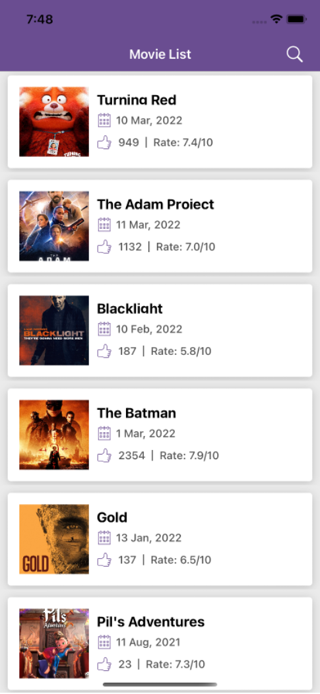
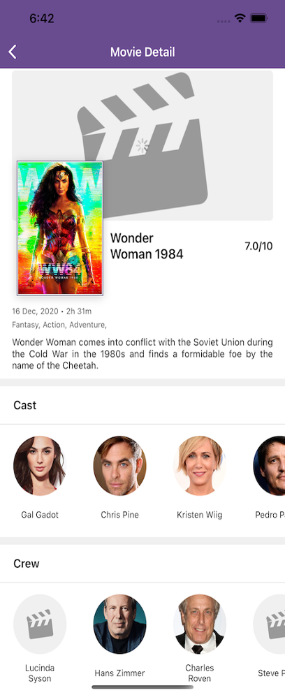
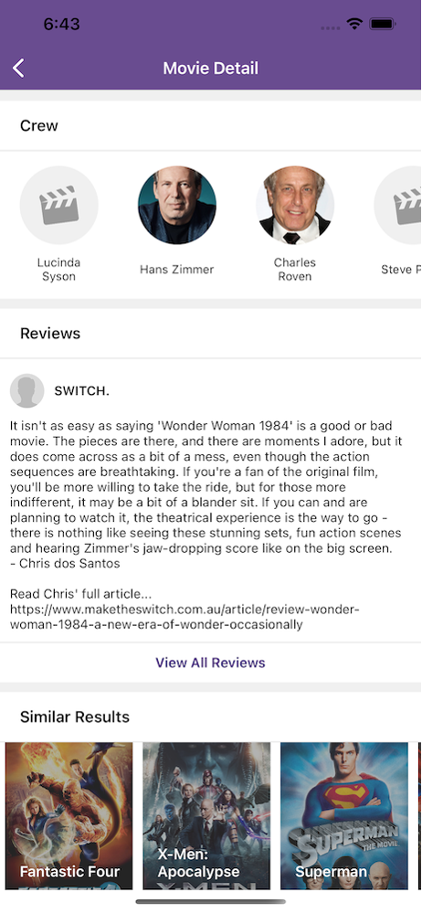
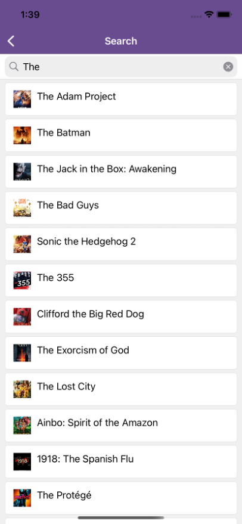

<img src="data:image/png;base64,iVBORw0KGgoAAAANSUhEUgAAAbMAAAB0CAMAAAA4qSwNAAAAw1BMVEX////tHCQjHyAAAADsAADtEhwfGxwbFhfwWl7z8/PtFyC8u7vsCRb0gIOnpqY1MjMRCgzvNDvuKzPsABDe3t7vSU4LAAP+9PWSkZGDgYJcWlr4t7i+vr5MSks8OToYExQtKSrKycr2o6X2m537z9D0kJLm5ubv7++bmppvbW1OTEz72drg4ODV1NT3rK7+9/fxZmrvPkOvrq7ycnX96eqKiYn0h4pxb2/xX2P5w8T2oKJDQEFiYGH96+zwU1fzd3v4vL3ac7MHAAAWpElEQVR4nO1da1viPBOGprQWEKtlK6BYWJWTsgqKrgvr+v9/1ZuUUzIzSQOPu/Z6L+4Pz0GSNMndJHPKtFD4v8Pdxe3PSZHjbPJ0+/Z7jwZ+3D5OzkQLxdOj4+u358/v439EMGrJGF1qS9ZaKkbdf9hNS9wcR25ULZXTGS+XItc9u91lzu+uJ+62Ad5ClTcRPV08ZNa8fj/Kxrc7XvK7TckV3i94yy8vL8cXb8cv4jHpvwLmy0icQNermVrSZ5UdJuOf4MeZWy0ClCP3/c2u+u/rohuVYAMcVdd9zGrj2C1lw73hJW9tSq4rfC8UJm4UucffXVcQPomqgjNHQdjU9aoRqiXzxtlFyS0TE14sltz0/c7A3aMb0fWXbZz9MFY/Rm8LgSVnkUXJFSL+0N93xcnzw3UUHRcKz26xiDlz2FjTq3xz9vxNw9hyxq+zqv/ES1RF2S1eGBr4e5wVHsoTvkNGZyX+T/eM4sy70vQq15x9uNSmJs3WkbH6S0b1FGV3ol+vf50z98V9K5z9fC8TnDlsQPcqz5xdu5mjP9XLETdFy2ksube6Nv4+ZzfVP8/uxXuJ4sxhPbJXOebsNpMyLkh809fW76po1r9ptIe/z9ndcfXFLXyjOUtaZK/yy9kPC8r4+P+QlR+OrGqvUSrdkM38A85u3OioMKE5c9iU6lVuObuznHSXktfPT3eYQoGy+0F14m9yVj1N98ZC2b0oTAhZP0VIKWm1OKecnVnID+lsF3Hd30XLyvLMU/Lj3+Ts6JHvJVz+uf72UHh613H2SvQqr5xlyx+bKfsF656f7k4Zb+cD9+IvcoZAcuYwwi6VU84eqtYSBF5oE5uZxnCxzP/1nHkdXDKnnH2npqBcKlFMwhPtccezbNN8FUmPX8+ZE89QyZxydorJqbqnR+9FQk2uqqLjd+2uKozDUVTVbpwlpDjkgDOH1WHJfHL2jOfd/ZOa8m++oclRN0edvFly3dPH4+vr2z/vJZ0NEinXmLOylY2YeLxcYSfO/DksuTtnQe/+vt7raT0FGbX7vV6vn1X5ByJmKyEcoXl0ZcfMN3IZVd2fF+ebMne3RVrjhkca4qz8DSO1ff2ayH/CLSsVSBOnjjOH1UDJ3Tir14adhAnE3tWwhlatEb3pbNTxQl459DujWYU2zKT4A+cq2pqDzzFn0oFGauLl1SKV8KNMbWaliVoKceZm+9wEzsAbUT7NrqPlzGF9teQOnN3PHBYn3rqkl8SsM7u3GgNnu9ERXK1rez7n7qShqw0XS7ks/fiCCN1K+w9lYv1Ep5QV+A/FLtDSMGfnREsYn8sZNGFNbTkbt1jowdb4qmnpvDwyLttEZVFb4xaHYy69Sz/ewMmOtsfQNbF63Ee6UxfE/ggUh3xw5jA1zmAKSmo46y+YT7fns5Zhk0sxnusq89pzivMi5Oyn9OO5G6lwN4IjtczcY12/EPmitCIf5IQzJ1ZK2nE2ZYm+wQQdkipetYwtWSN86OYxX0NsNjTiNNMYkVMQpJXP5AJ54Uw1YVlxtjA0l1aifQYp7juhubITd9BChWMu0uIxwgQJjVjnkkHocq5s4c8LZ2qcgQVnwUnWrDthp4+qLdFl+ByD8JFRbYK2OBH3kglCN3PNcXU/kRBafZJ+zg1nigkrm7N+x7Avbqbdp0mrZKzQ9VNBMN9PrGTZhOxgY0QW1b8JlqWfc8OZEze2JTM5Czqm00gijdKTL+0oQ+ZrSvwruU9ZQY1oeaqnEwWCZknbyw9ncpxBJmdzi1UmkBBRQnVbymDoAyXRCWPGo3GtYYsX6RRTcI44q0pyZo4480ebklmcvcZ0Exgxcs8FneyzbNOlE+OgN6wd0UEAKT4gZ+VS9lRh81TR8OO/tIP46uxt4wzggQM4I88jzyO5QEt0mCm7SFAp15rJSy5trRNABpLqS/ZUYblFWkuIs+j6O8Qv4i36DM6SZkf9wybOoGvkLEggO17IYufkxGFYY/NA8IL1YbZ6snyk4S1LYq34i96h3qHk4hoW5QbI7SPVwnb9CIGKtPsMzsIa2AOT4aqkmbNXuFJiZ9ZNJcRet5nAbRNEmJM7ox/GLA4pscZXDkRTbEE5il4o1tCGGtnsZHgtfdf/RiAiopk/hbNBYaTO0/qtNnIGZQg/lC0eQQPqXoogUcPLzIvDVmNamTZGYYwJVV8XrB4rE+Vi1tDaNOvTa1zAt0PaUb+Us0bhXv3TWkkzcjZU979kDpSwMdADEvlMwsssdGrrBvoDDx12niKGPBvuRqRTVYWqFxIbbY4zqtrWpvylnPFda6D+bRVnYOKsB/bTNnpOHxAjeXqw9KIaFoMmLqAoaTdZgcAw0B7b+1FEFoVzWE1anl/NWeEK7I6pCcvE2UxZCl5CaM1g94y3e2cLnlkoJhaqGU6yUH7PJA1cjHlDnFkZKR+gE6G8dXx+OWdj9Y/LOAMTZ+oigvalJQYxblOgBwkhwpgRaUDwvCtmTZkr+2jQwUTHBiNAwVEynnw5Z4WmeoSkLhQokEucqRzrbkOputpmc4R8ECFfqENIwzv/mbXUoslWNMScZVpBUiDOthP89ZwVHPX0iXvGdaaG8ocaJ1kzIasD8UWVLzYAx2GCTCk/qhkxaNUtaYizyMYXkO+9ES0qcX6M9ZyBE6mjgfqg9XKCwgnt/garkVjL58eumbVoc28Qn2fae2XKE5AMsg1kyAFnhYX69vOZNHAGhQiPhFpmbcnsQ0OMpqPAmBITHp3nF9OVaCleH8mNJU0giApkvJJiXPPAGfi75xg4Q1KEDTRqX0idZgJN8BKRAUHnv85Mt2zXbk2kaFFXZjAu4DqWlmceOIObUdi813IGTzo7rNxo4Dm0zFlAWpw26uvtp36LXK+Lc8Sra5NF5AnZrrYqwldytjEvFtrqjhcPtKKbpYsZIF6ar0DYJNMFMkL9jrzXmOL5JdIJkdHKjIVcnlaCIxRB5GDifHAGdzyk+W44g5GPdliZHMH1UaYL9gbdiU0RXA8/NFvkOsAHrZiSOa9BCuxelXxkmDMX4y/Z9becQRMWmvP8csbxRuYLWRsIiSj/7M3xEREtxX9jn+fzOcRvwnnwyZwVTozO43xzxpcFcVN6bbjA7suqNh51DRyPIGsIX+mnljmDkqKOs/3OM/a3zrMNiBQU68t++NZaRqgccZtDcZR+ZTyIzBmyGGk4209uDJcaFpQHdXIjWMzLpz+gQOEPuQ4OFl5vgTgioZqhouGlWa5KP+eGs4Jv2B23nEEtgFapAXx/WRks5kSXIw2YuJZ3GnFAvjrz6IrZWtKjYlLNoiO+LR/JTrf8cGYK1NhyFqhLwDuxwsqwD+0g6iWBLaAema5SpGgBh/MvuJw2ogbh3DaKIX/w4aiUzw9n8O2mOQOqHL7Wa8SVLtBLATj2vCXj2GqrGjSQfLjRqJCZWNTVH2m/cHHl1tSXcuYvjD/TnKnnXqxJcqbBK7Dre2Q3wcm6NtfgKxaKRxpFGW/XBhEXWSrqVhpBGQjVyhFn2NtIcaYKIRpvig5Q6iQTysAAyLWogg4s1UKPdsBos5Soq7mliE6HekyVVXfhPHEGo7BIzoCsotnedD2AwimRjLCBggtWahwyaBSr0lwhy0W5uNWaqBQ8ZfcYT/XdhDJggkvwueJMa7SXOYNGd8JR8jpvy7jayvQLeGYi0maIsvVaxBldqtsggnO0/0lOSk2kf1S9VU+1u0fSDKZcZCrkjDOtCUvmDAaQnCBrRoP5sqSfONufsHrHFjLpvRYusPbEEBMfPa5m6xmvJMXa8UTb/yP36Mfdcjk+3Pz6Rue8LVcBJfniDEZhUZxBT7XvAPcW3NyU7fMKaYFJvElzUG/GSHbdBgA9EDmSqqXbu/Pzm2Mih7eigyGhc41S5EZnk/fJmUvnAS8SQT8540xjwlI4g2U89ioZoepwpahiCmX7CtnVsNFoDE8YYYuRjCXIcFtM87NzUOtDVcHo3XHVRrlEJaNYIULWyZxxVmiSNmDV64gUuYS1auN+EPTr0xa6ZQEu/s2plewlYRiimxtpH7cXrHBohwmqSmVKeGUGkSc3b5zRdyBUzvp4OfgxY4nHWIwYgeK82RiNnywr7Zr7ZySQeYoS4rNROsN8fClnI6IQaQQG3n29IofgOfAB9ErWUdaQq9olI17OB75/+7gHaaUyoXp/JWceyk0mQN3p2/+eJxF/Q+6ONOBlAPtUp5QVeHfSSMpyyFlAmB1RFM3I8rImpXL3iIRJNDyY98A2hbTmwhKZzMqA6hlp4MofZ9TOh/MW2F2Cp7+5MLbIDpL2D1ugbbLri9nQ2O2vd0ivz6l4p/3POeSs0EJ8ENFqc4uVpvtMhk1KF0EZEdf4ZEUamapd4KZqnZW4rP2QRR45wyYsKsIQWyzQnGvjOOpJ9jJNPDL0wIY0g0sz+4LGCtGZ9tp1HjnDJiwyKhRdwgVzHhs+dBe0sxhnbU2Ez0v2BTTjB8zeijZfL9F/LSannCETFh3JO3b04qPHWuZUtQNTUjpjVro3860Yd5IVCvcryrjhW3WfTFE+X8oZvla7guGOhYIBZW0SiMPMDMa9hZa1RDUcI9xq71eUI6tcc9+L+k+glVz32Mz6v+UMoKMt2gQldQwEDYbzMPosOyJRoD4k7CbCpPKalRv3/JrK0l2Ksr4QuMXNE2UULldd9z2ziT8oaNiOszKslpl3i2NaAbAtOjUkPa20pJTCaUbhlnVm92A6YixOVrU9P4l57alV8vC724krvqFaFXnOq+L7qe7k1uK7kFvcLFuIpBbOjj8spv/mAuCHXUzqB6z3sUt3PxndxsJZrkev1ejumK+9O2i2nVgkDXfazZpNHuM1Hu4+rl/+PHI8vVx/7MTXGndvv27XLVzc2S2X/yMEvZ7xEMqq/mkdOeCAAw444IADDjjggAMOOOCAAw444IADDjjggP8H1BWodvRA/VHvLus2FvP2vDW71Nnh7+tqgBtvGZn7e/gJ9brez1mvvbbn81FzaihiqL5Gv9Jszdvt4cDC39MdLNpt8UjtTPThFBbSscsgOzpY8GatHYyq5xl+DFLBkG4hmPksTHxPeDbjIT30K6am1+kyhlL+jfgjwGQwhoLEV6hcCa8oRxKztiajSMCYJsnuBuOFcM2KZkLmDIyen34zEcPkCJnu26KFGuG899RZJGoN0z4k7MQyd0Ao4IuvgXAAzips+eclGHXNWXQz9PxVfxIvoUu1fZWzMQsbsEzLR3cF5tQXnDjqc+Z54gJHKL6k7LM2+eIHnq+NbVmiyXvMmwjFN5l9L/YNb7oYpigmHikGTAcj1WKckubEcxJpFnE3T0I+Ft6271smfGgKDH2vnf6HukoqzBvNmhuQ4RxD5vhsURGbUK/bZKET4s832nLmwahwDWcVPsHsavnJ6/HghPEppJZaFme9k9iJ41nqQu9VFqJRXT4Z8clL/jpeiqEF3VkcOklM7SgazrZz2MSv9CL0wlogPj+b+Fn7goQxI7PfVFiYlTWiFTvyx3CDmaAQk2bFWTL3PPU1pDmr8flzpKmpJAl5BSCDs17ISZJ6cT9i2q+NzkOHDaUTmA+TDGgmOfM7hl6IK0fx6tid4y9fmurpOEMzq2IRw1DuMd+1QrRvWHEWLvgGpByaJGeXfJDq1AajEF5CTP9s5Iz/6oXqtA84aeTW3grhS9HlwyTeTZoz3aGc4jXZxKNxGujzh8K+nPE3Hr3gPebBj5HbctYqXHnK3FOc9ZgTomuNgjT0opg5a/HDF8qu1HgK6V1w9ErwYfo4encPzq78bTZsJ7TPrLInZ30Gru+lGPOTGg7cljO+SjvSnyjORj4xV3zk+EUxcjZlVIonzg7OJ94jmRTDRCfHHpwl0tXy4dz+QNuTs9eEvBR6j/UiW84KzVD+6usIc8a3fyrDo5hXeL4YOePnEXVWt/0QzcQiSaj7yhT24qxj2biK/TgLiHnSwJqzQigfEy3MWYuYVIFZmED90cRZhdFTNWbwSzTp62CIvlWwB2dz4kKdDfbjrBaTy4yCHWdihi+Z1CjmLNBNoNinYVkDZy1fE4ne8qFWPMBvgxZ7cNYMrWdRwX6cLRKb/LIp7GT9k+W/tocH5qzCdCMcIUHZwFkQkumdCiIbK5yKNq39kdiDs3u+sue7BEqvoOfMpJ/F+tzBEHzcyv8bOOuzra6AOZuFui4NQrhyDJxxWUdzZesevRRMRy+BPfQzLqwKS05t13BrLWfJ8HJ7pwKKu1zGso3Nbvuxcj9jEGo5E1ai182fIGfDRPfS8xcMmDANnImR0b8EMTjo+Kary9yKobGDyBdTcKVpHHp+zEY7JePTc+YkknUT6Hv8aNF9jgeh7acXJjYIHT1nXG5f73ILxBk/bjT7yHgXzqb0gAU6nqO8iT2NtEJCw5k8dqJWMHNY4vjM2YU1PWd+vMHf52xFEN+4VuwNw3xx1q1cqqiAHU3DWSjNIv3U7msYihxhmk5RNXSc+YvaFrA3/PC0fQDfG5Xh0nvjmqCNkrZAnPG9UWOS23Vv1ExPwECWV3lvXMD7lVBM13AmTaJWQOjPmKfN6UDgX8ggFnKjv/5Pf6WkYc5mSNJYo7GbDKITP40yiMpZ7CD1Yh8ZZNupxNN/xQNhP1kfqzJa2HG22WrXEj3mbKoVHnaT9WNPIz9hWX++tYHejyXUpzHK27WHrC+BK/TWM7onZ1zZtLXp7MgZFz5SJQ1z1tNtyMFuOrVW6VqgF7ERas4+vsHDH/4bZ4VmkuVI2WI/zu7tjTq7ciacAwElgwjLPyldDWL0Apk4G8Q+6SrrYduVePvJNel56Gz9j5xd6kUjhD1txCPf1t+zK2ciX8WrEEYQZ1OGEwkW0i9poAk0cdYnygsME5wp/sojv1dZI3qyO2fN9mg7M11GG1Mp7MmZsLHjHabfWrTgdOzM2VJJIzgrOB41rkWCPTRGu/6M68549VSoreOStIX3YsJDsztnr7H0QIvAgA329XkOQy9ERul5iGfajrNYKcFlbooz8aIg0bFBeWiMnAUO4Zodx5RDMHWPQiaDKx/mkSzsw9kgloy2zdA+uGDv2IIO8s8H7ZBwutvF8ChCBFfSBjOCs0KTITWmQXolzX5q4XUZwT95IXXKBYnn+eq72b9KPOJry7tzxp+5GSN/zmfI+hlLte/5qu+w6yXUQbEHZ4HnOSMyEGnI1Pz7/QX/A3HiZMTwCMtcR+7qgFNG+4nvRfSHvLgrIv7nc2J45r5kXiU/u0JDbyN+7W6NF5TRqN8JHdapLRdWv9IWNmpiee/BWRpdSXztneNV2EHXcX1jEaRI2g8461dbKxM1PM7EaGV+6tU6fGPUebLqYSINczrnYm24Q6ycbO2CP4u4q9Y4KPQvT/g47K37djZiWpkdimhO5rVHI4elcYeU+L8PZyLLJ82ZMP3znsVXo9E8ZKEX++QpEHiOFMNLFKh3xCvGnNGo7bHYS6izbN1WK42C9fkwO+kwR+TsajgzxhE3RHhhHDJG6A4GdJHRPsWUhWFmHHGh22Zx4vm+L4K/O7Rpem4X+63+ocdiXcK0/qsIWvaWz9QZ6YI43nReY5uthSIrl+h7ErOhUdmsXImiq0deacwVVOx3R51FXInrNV6axC3cgTK+MSADsEC9pkDrre3VXq/4QzsL7UWFKbCN8gei/lWQ/bRbq2m9E0Gl2RbPbDX0A61Z2Ga7jVaHtzNvZidBqw8WJ7zoyXCgDeAY12pIfJ3WsvrRa8x5uwtbT8z/AIM3Utx6l7hzAAAAAElFTkSuQmCC"/>

# Movie Catalogue Application

Create a simple movie catalogue application, which use to display list of movies. User can view various details like movie title, date, category, images, details, review, cast and crew etc. Users can search for a movie and view the details along with review listing. 

## <marquee direction="right" behavior="alternate" > Submit your assignment within 3 days.</marquee>

## API Links & Documentation

https://developers.themoviedb.org/3/getting-started/introduction

## API Key

Sign-up yourself in the link below and generate a new key for API.

## To Generate API Key

https://www.themoviedb.org/settings/api

https://kb.synology.com/en-me/DSM/tutorial/How_to_apply_for_a_personal_API_key_to_get_video_info

## 1. Movie List Page
						
Listing page will display the list of movies. Display the list of data fetched from the API given below. List contains the attributes like name of the movie, release date, poster image, movie likes and rating. List should be sorted based on highest rating. API calls should include pagination for movies listing. When clicked on a movie item in the list, open the movie details page. User should be navigated to search page when clicked on search. 

### API

* Movie Listing: https://api.themoviedb.org/3/movie/now_playing?api_key={api_key}

### Design Reference

## 2. Movie Detail Page

Movie details page should display all the details of a movie. Display all the attributes like movie name, rating, poster image, genre types, release date, and movie total timing. The details screen has additional information such as:

* Cast and Crew
* Movie Reviews
* Similar Movies

When clicked on View all Reviews , users should be redirected to review listing page with the same User interface. On click of a Similar Results, open details of that movie. 

### API 

* Movie Details: https://api.themoviedb.org/3/movie/{movie_id}?api_key={api_key}
* Movie Reviews: https://api.themoviedb.org/3/movie/{movie_id}/reviews?api_key={api_key}
* Similar Movies: https://api.themoviedb.org/3/movie/{movie_id}/similar?api_key={api_key}
* Cast and Crew: https://api.themoviedb.org/3/movie/{movie_id}/credits?api_key={api_key} 

### Design Reference

 | 

## 3. Search Movie

Users should be able to search for a movie by typing the in the search field. As the user types each character, the API should be called displaying the results. The app should store the last 5 recent search results in local database and display them recently searched list. Search item should contain name of movie and poster image and on click of searched movie item user should be navigate to the movie detail page.

### API

* Search Movie: https://api.themoviedb.org/3/search/movie?api_key={api_key}&query={serach_String}

### Design Reference

 | 

## Tips:

1.	You can use any third-party library that you know.
2.	Must support respective platform UI and components.
3.	Develop in small, meaningful steps, with regular commits and clear messages (use git).
4.	Provide Readme for documentation.

## Recommendations

Domain | iOS | Android | Flutter | React Native
--| -- | -- | -- | -- |
Language | Swift/ Objective C / Swift UI | Kotlin / Jetpack Compose | Dart | JavaScript
Architecture | MVVM / VIPER / VIP / MVP with clean architecture | MVVM or MVP with clean architecture | MVVM/MVC with clean architecture | MVVM/MVP with clean architecture
State Management | Reactive | Data binding with live data | Provider / GetX / BLoC / Riverpod | Redux / Context | 
Recommended 3rd Party Libraries | FMDB, Magical Record |  Retrofit, RxJava, Kotlin or Dagger, Android Jetpacks - LiveData, Data Binding, Room | dio, hive, sqflite, cached_network_image | Axios, redux-saga, react-redux, Jest
Dependency Injection | &#10003; | &#10003; | &#10003; | &#10003;
Unit Testing | &#10003; | &#10003; | &#10003; | &#10003;

## Good to have

1.	Dependency Injection.
2.	Unit Test Cases.
3.	Readme for documentation.
4.	Code comments and code modularization.

## Submission will be rejected if

1.	Common Code Guidelines are not followed properly.
2.	Regular MVC used.
3.	Git commit history not available.
4.	Readme not available.

## Required

1.	Source Code
2.	Screenshots

## <marquee direction="right" behavior="alternate" > Submit your assignment within 3 days.</marquee>

## Important:

This repository is only intented for training and development purpose. Please do not misuse it. (Not for commercial use) 